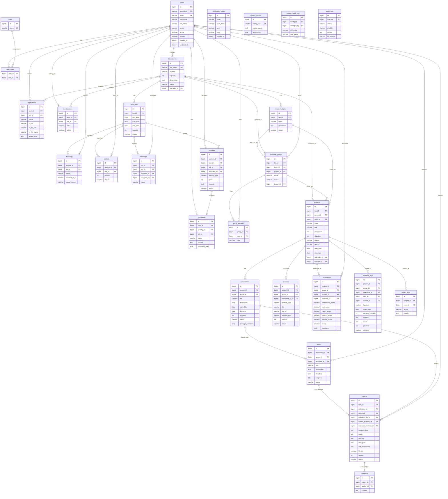

# Phụ lục — Tài liệu Chi tiết Dự án Lab Portal

> **Tài liệu bổ sung cho:** [Tổng quan Dự án Lab Portal](file:///C:/Users/nvtqx/.gemini/antigravity-ide/brain/dba80f65-8392-4d21-a080-c8b11a6b84e9/lab_portal_overview.md)

---

## Phụ lục A: Danh sách API Endpoints

> Tất cả endpoint đều có prefix `/api` (context-path).
> Swagger UI: `http://localhost:8080/api/swagger-ui.html`

---

### A.1. Module Auth (`/api/auth/*`)

| # | Method | Endpoint | Role | Mô tả |
|---|--------|----------|------|-------|
| 1 | POST | `/auth/login` | Public | Đăng nhập, trả JWT |
| 2 | POST | `/auth/register/send-code` | Public | Gửi OTP đăng ký qua email |
| 3 | POST | `/auth/register/verify-code` | Public | Xác minh OTP đăng ký |
| 4 | POST | `/auth/register` | Public | Hoàn tất đăng ký tài khoản STUDENT |
| 5 | POST | `/auth/forgot-password/send-code` | Public | Gửi OTP reset mật khẩu |
| 6 | POST | `/auth/forgot-password/verify-code` | Public | Xác minh OTP reset |
| 7 | POST | `/auth/reset-password` | Public | Đặt lại mật khẩu |
| 8 | POST | `/auth/refresh-token` | Authenticated | Làm mới access token |
| 9 | GET | `/auth/me` | Authenticated | Lấy thông tin user hiện tại |
| 10 | PUT | `/auth/me` | Authenticated | Cập nhật profile |
| 11 | GET | `/auth/roles` | Authenticated | Danh sách role hệ thống |
| 12 | GET | `/auth/users` | Authenticated | Danh sách users |
| 13 | GET | `/auth/users/{id}` | Authenticated | Xem user theo ID |
| 14 | GET | `/auth/health` | Public | Health check |

> Source: [AuthController.java](file:///d:/CV/Lab-Portal/server/src/main/java/com/web/labportalbackend/auth/controller/AuthController.java)

---

### A.2. Module Admin User (`/api/admin/users/*`)

| # | Method | Endpoint | Role | Mô tả |
|---|--------|----------|------|-------|
| 15 | GET | `/admin/users` | ADMIN | Danh sách user (trừ ADMIN) |
| 16 | GET | `/admin/users/assignable-managers` | ADMIN | Danh sách có thể gán Manager |
| 17 | PUT | `/admin/users/{id}/roles` | ADMIN | Cập nhật nhiều roles |
| 18 | PATCH | `/admin/users/{id}/role` | ADMIN | Cập nhật 1 role |
| 19 | PUT | `/admin/users/{id}/ban` | ADMIN | Khóa tài khoản |
| 20 | PUT | `/admin/users/{id}/unban` | ADMIN | Mở khóa tài khoản |

> Source: [AdminUserController.java](file:///d:/CV/Lab-Portal/server/src/main/java/com/web/labportalbackend/auth/controller/AdminUserController.java)

---

### A.3. Module Admin Dashboard & System

| # | Method | Endpoint | Role | Mô tả |
|---|--------|----------|------|-------|
| 21 | GET | `/admin/dashboard/stats` | ADMIN | Thống kê hệ thống tổng quan |
| 22 | GET | `/admin/system-config` | ADMIN | Lấy cấu hình hệ thống |
| 23 | PUT | `/admin/system-config` | ADMIN | Cập nhật cấu hình |
| 24 | GET | `/admin/audit-logs` | ADMIN | Danh sách nhật ký kiểm toán |

> Source: [AdminDashboardController.java](file:///d:/CV/Lab-Portal/server/src/main/java/com/web/labportalbackend/admin/dashboard/controller/AdminDashboardController.java), [SystemConfigController.java](file:///d:/CV/Lab-Portal/server/src/main/java/com/web/labportalbackend/admin/systemconfig/controller/SystemConfigController.java), [AdminAuditLogController.java](file:///d:/CV/Lab-Portal/server/src/main/java/com/web/labportalbackend/admin/audit/controller/AdminAuditLogController.java)

---

### A.4. Module Laboratory (`/api/labs/*`)

| # | Method | Endpoint | Role | Mô tả |
|---|--------|----------|------|-------|
| 25 | POST | `/labs` | ADMIN | Tạo PTN mới |
| 26 | GET | `/labs` | Authenticated | Danh sách PTN |
| 27 | GET | `/labs/{id}` | Authenticated | Chi tiết PTN |
| 28 | PUT | `/labs/{id}` | ADMIN | Cập nhật PTN (pending) |
| 29 | DELETE | `/labs/{id}` | ADMIN | Xóa PTN (pending) |
| 30 | PUT | `/labs/{id}/manager` | ADMIN | Gán Manager cho PTN |
| 31 | PATCH | `/labs/{id}/status` | ADMIN | Cập nhật trạng thái PTN |
| 32 | GET | `/labs/{id}/members` | LAB_MANAGER | Danh sách thành viên PTN |
| 33 | PATCH | `/labs/{id}/members/{userId}/remove` | LAB_MANAGER | Xóa thành viên khỏi PTN |
| 34 | GET | `/labs/{id}/research-eligible-students` | LAB_MANAGER | SV đủ điều kiện NCKH |
| 35 | GET | `/labs/{id}/dashboard/stats` | LAB_MANAGER | Thống kê dashboard PTN |
| 36 | POST | `/labs/{id}/apply` | STUDENT | Nộp đơn ứng tuyển (multipart) |
| 37 | GET | `/labs/health` | Public | Health check |

> Source: [LaboratoryController.java](file:///d:/CV/Lab-Portal/server/src/main/java/com/web/labportalbackend/lab/controller/LaboratoryController.java)

---

### A.5. Module Application (Ứng tuyển) (`/api/applications/*`)

| # | Method | Endpoint | Role | Mô tả |
|---|--------|----------|------|-------|
| 38 | POST | `/applications/labs/{labId}/apply` | STUDENT | Nộp đơn ứng tuyển (multipart) |
| 39 | PUT | `/applications/{id}/review` | LAB_MANAGER | Duyệt/từ chối đơn |
| 40 | GET | `/applications` | ADMIN/LAB_MANAGER | Danh sách đơn (phân trang) |
| 41 | GET | `/applications/{id}` | Authenticated | Chi tiết đơn |
| 42 | GET | `/applications/users/{userId}` | Authenticated | Đơn theo user |
| 43 | GET | `/applications/labs/{labId}` | LAB_MANAGER | Đơn theo PTN |

> Source: [ApplicationController.java](file:///d:/CV/Lab-Portal/server/src/main/java/com/web/labportalbackend/lab/controller/ApplicationController.java)

---

### A.6. Module TimeSlot (`/api/slots/*`)

| # | Method | Endpoint | Role | Mô tả |
|---|--------|----------|------|-------|
| 44 | GET | `/labs/{labId}/slots` | Authenticated | Danh sách slot theo PTN |
| 45 | POST | `/slots` | LAB_MANAGER | Tạo slot mới |
| 46 | GET | `/slots/{slotId}` | Authenticated | Chi tiết slot |
| 47 | PATCH | `/slots/{slotId}/status` | LAB_MANAGER | Cập nhật trạng thái slot |
| 48 | PATCH | `/slots/{slotId}/cancel` | LAB_MANAGER | Hủy slot (thông báo SV) |
| 49 | DELETE | `/slots/{slotId}` | LAB_MANAGER | Soft-delete slot |

> Source: [TimeSlotController.java](file:///d:/CV/Lab-Portal/server/src/main/java/com/web/labportalbackend/booking/controller/TimeSlotController.java)

---

### A.7. Module Booking (`/api/bookings/*`)

| # | Method | Endpoint | Role | Mô tả |
|---|--------|----------|------|-------|
| 50 | POST | `/bookings` | STUDENT | Đăng ký đặt phòng |
| 51 | GET | `/bookings/me` | STUDENT | Danh sách booking của tôi |
| 52 | PATCH | `/bookings/{id}/cancel` | STUDENT | Hủy booking |
| 53 | PATCH | `/bookings/{id}/review` | LAB_MANAGER | Duyệt/từ chối booking |
| 54 | GET | `/slots/{slotId}/registrations` | LAB_MANAGER | Booking theo slot |
| 55 | GET | `/slots/{slotId}/bookings` | LAB_MANAGER | Booking theo slot (alias) |

> Source: [BookingController.java](file:///d:/CV/Lab-Portal/server/src/main/java/com/web/labportalbackend/booking/controller/BookingController.java)

---

### A.8. Module Check-in (`/api/checkin/*`)

| # | Method | Endpoint | Role | Mô tả |
|---|--------|----------|------|-------|
| 56 | POST | `/checkin/qr` | STUDENT | Tạo QR token check-in |
| 57 | POST | `/checkin/confirm` | LAB_MANAGER | Xác nhận check-in qua QR |

> Source: [CheckinController.java](file:///d:/CV/Lab-Portal/server/src/main/java/com/web/labportalbackend/booking/controller/CheckinController.java)

---

### A.9. Module Cleaning (Vệ sinh)

| # | Method | Endpoint | Role | Mô tả |
|---|--------|----------|------|-------|
| 58 | GET | `/cleaning/pending` | STUDENT | Nhiệm vụ vệ sinh chờ xử lý |
| 59 | POST | `/cleaning/assign` | LAB_MANAGER | Phân công vệ sinh |
| 60 | POST | `/cleaning/confirm` | STUDENT | Xác nhận hoàn thành |
| 61 | GET | `/labs/{labId}/cleaning-tasks` | LAB_MANAGER | Nhiệm vụ vệ sinh theo PTN |
| 62 | GET | `/slots/{slotId}/eligible-cleaners` | LAB_MANAGER | SV đủ điều kiện vệ sinh |
| 63 | POST | `/cleaning-tasks` | LAB_MANAGER | Phân công vệ sinh (nhiều SV) |
| 64 | GET | `/users/me/cleaning-tasks` | STUDENT | Nhiệm vụ vệ sinh của tôi |
| 65 | PATCH | `/cleaning-tasks/{id}/complete` | STUDENT | Hoàn thành vệ sinh |
| 66 | PATCH | `/cleaning-tasks/{id}/cancel` | LAB_MANAGER | Hủy nhiệm vụ vệ sinh |

> Source: [CleaningController.java](file:///d:/CV/Lab-Portal/server/src/main/java/com/web/labportalbackend/booking/controller/CleaningController.java)

---

### A.10. Module Penalty (Vi phạm)

| # | Method | Endpoint | Role | Mô tả |
|---|--------|----------|------|-------|
| 67 | PUT | `/config/penalty` | LAB_MANAGER | Cấu hình mức phạt |
| 68 | GET | `/users/{id}/penalties` | Authenticated | Lịch sử vi phạm theo user |
| 69 | GET | `/users/me/penalties` | Authenticated | Vi phạm của tôi |
| 70 | POST | `/penalties` | LAB_MANAGER | Ghi nhận vi phạm |
| 71 | GET | `/slots/{slotId}/penalties` | LAB_MANAGER | Vi phạm theo slot |

> Source: [PenaltyController.java](file:///d:/CV/Lab-Portal/server/src/main/java/com/web/labportalbackend/booking/controller/PenaltyController.java)

---

### A.11. Module Complaint (Khiếu nại)

| # | Method | Endpoint | Role | Mô tả |
|---|--------|----------|------|-------|
| 72 | POST | `/complaints` | STUDENT | Nộp khiếu nại |
| 73 | GET | `/labs/{labId}/complaints` | LAB_MANAGER | Khiếu nại theo PTN |
| 74 | PATCH | `/complaints/{id}/review` | LAB_MANAGER | Xử lý khiếu nại |

> Source: [ComplaintController.java](file:///d:/CV/Lab-Portal/server/src/main/java/com/web/labportalbackend/booking/controller/ComplaintController.java)

---

### A.12. Module Research Topic (Đề tài)

| # | Method | Endpoint | Role | Mô tả |
|---|--------|----------|------|-------|
| 75 | GET | `/labs/{labId}/research-topics` | Authenticated | Đề tài theo PTN |
| 76 | POST | `/research-topics` | LAB_MANAGER | Tạo đề tài mới |

> Source: [ResearchTopicController.java](file:///d:/CV/Lab-Portal/server/src/main/java/com/web/labportalbackend/research/controller/ResearchTopicController.java)

---

### A.13. Module Research Group (Nhóm NC)

| # | Method | Endpoint | Role | Mô tả |
|---|--------|----------|------|-------|
| 77 | POST | `/groups` | LAB_MANAGER | Tạo nhóm NC |
| 78 | POST | `/research-groups` | LAB_MANAGER | Tạo nhóm NC cho dự án |
| 79 | PUT | `/research-groups/{id}` | LAB_MANAGER | Cập nhật nhóm NC |
| 80 | POST | `/groups/{id}/members` | LAB_MANAGER | Thêm thành viên nhóm |
| 81 | GET | `/labs/{id}/research-groups/me` | STUDENT | Nhóm NC của tôi theo PTN |
| 82 | GET | `/labs/{id}/groups` | LAB_MANAGER | Nhóm NC theo PTN |
| 83 | GET | `/research-topics/{id}/groups` | LAB_MANAGER | Nhóm NC theo đề tài |
| 84 | GET | `/research-projects/{id}/groups` | LAB_MANAGER/STUDENT | Nhóm NC theo dự án |
| 85 | GET | `/research-groups/{id}` | LAB_MANAGER/STUDENT | Chi tiết nhóm NC |
| 86 | GET | `/research-groups/{id}/members` | LAB_MANAGER/STUDENT | Thành viên nhóm NC |

> Source: [GroupController.java](file:///d:/CV/Lab-Portal/server/src/main/java/com/web/labportalbackend/research/controller/GroupController.java)

---

### A.14. Module Research Project (Dự án NC)

| # | Method | Endpoint | Role | Mô tả |
|---|--------|----------|------|-------|
| 87 | GET | `/labs/{labId}/research-projects` | LAB_MANAGER/STUDENT | Dự án NC theo PTN |
| 88 | POST | `/research-projects` | LAB_MANAGER | Tạo dự án NC |
| 89 | PUT | `/research-projects/{id}` | LAB_MANAGER | Cập nhật dự án NC |
| 90 | POST | `/projects` | LAB_MANAGER | Tạo project |
| 91 | GET | `/groups/{id}/projects` | LAB_MANAGER/STUDENT | Dự án theo nhóm |
| 92 | GET | `/projects/{id}` | LAB_MANAGER/STUDENT | Chi tiết project |
| 93 | GET | `/research-projects/{id}` | LAB_MANAGER/STUDENT | Chi tiết dự án NC |

> Source: [ProjectController.java](file:///d:/CV/Lab-Portal/server/src/main/java/com/web/labportalbackend/research/controller/ProjectController.java)

---

### A.15. Module Milestone (Mốc tiến độ)

| # | Method | Endpoint | Role | Mô tả |
|---|--------|----------|------|-------|
| 94 | POST | `/milestones` | LAB_MANAGER | Tạo milestone |
| 95 | GET | `/projects/{id}/milestones` | LAB_MANAGER/STUDENT | Milestone theo project |
| 96 | GET | `/research-groups/{groupId}/milestones` | LAB_MANAGER/STUDENT | Milestone theo nhóm |
| 97 | GET | `/research-groups/{groupId}/milestones/me` | LAB_MANAGER/STUDENT | Milestone của tôi theo nhóm |
| 98 | POST | `/research-groups/{groupId}/milestones` | LAB_MANAGER | Tạo milestone trong nhóm |
| 99 | GET | `/milestones/{id}` | LAB_MANAGER/STUDENT | Chi tiết milestone |
| 100 | PUT | `/milestones/{id}` | LAB_MANAGER | Cập nhật milestone |

> Source: [MilestoneController.java](file:///d:/CV/Lab-Portal/server/src/main/java/com/web/labportalbackend/research/controller/MilestoneController.java)

---

### A.16. Module Task (Nhiệm vụ)

| # | Method | Endpoint | Role | Mô tả |
|---|--------|----------|------|-------|
| 101 | GET | `/milestones/{id}/tasks` | LAB_MANAGER/STUDENT | Task theo milestone |
| 102 | GET | `/groups/{id}/tasks` | LAB_MANAGER/STUDENT | Task theo nhóm |
| 103 | GET | `/research-groups/{id}/tasks` | LAB_MANAGER/STUDENT | Task theo nhóm (alias) |
| 104 | GET | `/research-groups/{id}/tasks/me` | STUDENT | Task của tôi theo nhóm |
| 105 | POST | `/milestones/{milestoneId}/tasks` | LAB_MANAGER | Tạo task trong milestone |
| 106 | PUT | `/tasks/{id}/status` | LAB_MANAGER/STUDENT | Cập nhật trạng thái task |

> Source: [TaskController.java](file:///d:/CV/Lab-Portal/server/src/main/java/com/web/labportalbackend/research/controller/TaskController.java)

---

### A.17. Module Report (Báo cáo)

| # | Method | Endpoint | Role | Mô tả |
|---|--------|----------|------|-------|
| 107 | POST | `/reports` | STUDENT | Nộp báo cáo (multipart file) |
| 108 | GET | `/milestones/{id}/reports` | LAB_MANAGER/STUDENT | Báo cáo theo milestone |
| 109 | GET | `/milestones/{id}/reports/me` | STUDENT | Báo cáo của tôi theo milestone |
| 110 | GET | `/tasks/{id}/reports` | LAB_MANAGER/STUDENT | Báo cáo theo task |
| 111 | GET | `/reports/{id}/file` | LAB_MANAGER/STUDENT | Download file báo cáo |
| 112 | GET | `/groups/{id}/reports` | LAB_MANAGER/STUDENT | Báo cáo theo nhóm |
| 113 | GET | `/groups/{id}/reports/me` | STUDENT | Báo cáo của tôi theo nhóm |
| 114 | GET | `/labs/{id}/reports/pending-review` | LAB_MANAGER | Báo cáo chờ Manager duyệt |
| 115 | PATCH | `/reports/{id}/leader-review` | STUDENT (Leader) | Leader review báo cáo |
| 116 | PATCH | `/reports/{id}/manager-review` | LAB_MANAGER | Manager duyệt/từ chối |
| 117 | PATCH | `/reports/{id}/replace` | STUDENT | Cập nhật/thay thế báo cáo |

> Source: [ReportController.java](file:///d:/CV/Lab-Portal/server/src/main/java/com/web/labportalbackend/research/controller/ReportController.java)

---

### A.18. Module Product (Sản phẩm NC)

| # | Method | Endpoint | Role | Mô tả |
|---|--------|----------|------|-------|
| 118 | POST | `/products` | STUDENT | Nộp sản phẩm NC (multipart) |
| 119 | GET | `/projects/{projectId}/products` | LAB_MANAGER/STUDENT | Sản phẩm theo project |
| 120 | GET | `/research-groups/{groupId}/products` | LAB_MANAGER/STUDENT | Sản phẩm theo nhóm |

> Source: [ProductController.java](file:///d:/CV/Lab-Portal/server/src/main/java/com/web/labportalbackend/research/controller/ProductController.java)

---

### A.19. Module Evaluation (Đánh giá)

| # | Method | Endpoint | Role | Mô tả |
|---|--------|----------|------|-------|
| 121 | POST | `/evaluations` | LAB_MANAGER | Đánh giá SV trong dự án |
| 122 | GET | `/projects/{id}/evaluations` | LAB_MANAGER/STUDENT | Đánh giá theo project |
| 123 | GET | `/research-groups/{groupId}/evaluations` | LAB_MANAGER/STUDENT | Đánh giá theo nhóm |

> Source: [EvaluationController.java](file:///d:/CV/Lab-Portal/server/src/main/java/com/web/labportalbackend/research/controller/EvaluationController.java)

---

### A.20. Module Research Log (Nhật ký NC)

| # | Method | Endpoint | Role | Mô tả |
|---|--------|----------|------|-------|
| 124 | GET | `/projects/{projectId}/logs` | LAB_MANAGER/STUDENT | Nhật ký NC theo project (filter) |
| 125 | GET | `/research-groups/{groupId}/logs` | LAB_MANAGER/STUDENT | Nhật ký NC theo nhóm (filter) |
| 126 | POST | `/logs` | LAB_MANAGER/STUDENT | Tạo nhật ký NC thủ công |

> Source: [ResearchLogController.java](file:///d:/CV/Lab-Portal/server/src/main/java/com/web/labportalbackend/research/controller/ResearchLogController.java)

---

### A.21. Module Research Stats

| # | Method | Endpoint | Role | Mô tả |
|---|--------|----------|------|-------|
| 127 | GET | `/projects/{projectId}/stats?type=overview` | LAB_MANAGER/STUDENT | Thống kê tổng quan dự án |

> Source: [StatsController.java](file:///d:/CV/Lab-Portal/server/src/main/java/com/web/labportalbackend/research/controller/StatsController.java)

---

### Tổng kết API

| Module | Số endpoint | Ghi chú |
|--------|:-----------:|---------|
| Auth | 14 | Bao gồm public + authenticated |
| Admin User | 6 | Chỉ ADMIN |
| Admin Dashboard/System/Audit | 4 | Chỉ ADMIN |
| Laboratory | 13 | ADMIN + LAB_MANAGER |
| Application | 6 | STUDENT nộp, LAB_MANAGER duyệt |
| TimeSlot | 6 | LAB_MANAGER quản lý |
| Booking | 6 | STUDENT đặt, LAB_MANAGER duyệt |
| Check-in | 2 | QR-based |
| Cleaning | 9 | LAB_MANAGER + STUDENT |
| Penalty | 5 | LAB_MANAGER + STUDENT |
| Complaint | 3 | STUDENT + LAB_MANAGER |
| Research Topic | 2 | LAB_MANAGER |
| Research Group | 10 | LAB_MANAGER + STUDENT |
| Research Project | 7 | LAB_MANAGER + STUDENT |
| Milestone | 7 | LAB_MANAGER + STUDENT |
| Task | 6 | LAB_MANAGER + STUDENT |
| Report | 11 | STUDENT + Leader + LAB_MANAGER |
| Product | 3 | STUDENT + LAB_MANAGER |
| Evaluation | 3 | LAB_MANAGER + STUDENT |
| Research Log | 3 | LAB_MANAGER + STUDENT |
| Research Stats | 1 | LAB_MANAGER + STUDENT |
| **Tổng** | **~127** | |

---

## Phụ lục B: Sơ đồ ERD (Entity Relationship Diagram)

### B.1. Toàn bộ hệ thống



---

## Phụ lục C: Ma trận Phân quyền RBAC

### C.1. Ma trận Module — Role

| Chức năng | ADMIN | LAB_MANAGER | STUDENT (no member) | STUDENT (member) | LEADER |
|-----------|:-----:|:-----------:|:-------------------:|:----------------:|:------:|
| **Auth — Đăng ký/Đăng nhập** | — | — | ✅ | ✅ | ✅ |
| **Admin — Dashboard** | ✅ | — | — | — | — |
| **Admin — User Management** | ✅ | — | — | — | — |
| **Admin — Lab Management** | ✅ | — | — | — | — |
| **Admin — System Config** | ✅ | — | — | — | — |
| **Admin — Audit Log** | ✅ | — | — | — | — |
| **Lab — Xem danh sách PTN** | ✅ | ✅ | ✅ | ✅ | ✅ |
| **Lab — Tạo PTN** | ✅ | — | — | — | — |
| **Lab — Gán Manager** | ✅ | — | — | — | — |
| **Lab — Dashboard PTN** | — | ✅ (own) | — | — | — |
| **Lab — Quản lý thành viên** | — | ✅ (own) | — | — | — |
| **Application — Nộp đơn** | — | — | ✅ | ✅ | ✅ |
| **Application — Duyệt/Từ chối** | — | ✅ (own) | — | — | — |
| **Slot — Tạo/Quản lý** | — | ✅ (own) | — | — | — |
| **Slot — Xem** | — | ✅ | — | ✅ | ✅ |
| **Booking — Đăng ký** | — | — | — | ✅ | ✅ |
| **Booking — Duyệt** | — | ✅ (own) | — | — | — |
| **Booking — Hủy (SV)** | — | — | — | ✅ | ✅ |
| **Check-in — Tạo QR** | — | — | — | ✅ | ✅ |
| **Check-in — Xác nhận** | — | ✅ | — | — | — |
| **Cleaning — Phân công** | — | ✅ (own) | — | — | — |
| **Cleaning — Hoàn thành** | — | — | — | ✅ | ✅ |
| **Penalty — Ghi nhận** | — | ✅ | — | — | — |
| **Penalty — Xem** | — | ✅ | — | ✅ | ✅ |
| **Complaint — Nộp** | — | — | — | ✅ | ✅ |
| **Complaint — Xử lý** | — | ✅ (own) | — | — | — |
| **Research — Tạo đề tài** | — | ✅ | — | — | — |
| **Research — Tạo nhóm** | — | ✅ | — | — | — |
| **Research — Tạo dự án** | — | ✅ | — | — | — |
| **Research — Tạo milestone** | — | ✅ | — | — | — |
| **Research — Tạo task** | — | ✅ | — | — | — |
| **Research — Xem dự án** | — | ✅ | — | ✅ | ✅ |
| **Research — Cập nhật task status** | — | ✅ | — | ✅ | ✅ |
| **Research — Nộp báo cáo** | — | — | — | ✅ | ✅ |
| **Research — Leader review** | — | — | — | — | ✅ |
| **Research — Manager review** | — | ✅ | — | — | — |
| **Research — Nộp sản phẩm** | — | — | — | ✅ | ✅ |
| **Research — Đánh giá SV** | — | ✅ | — | — | — |
| **Research — Ghi nhật ký** | — | ✅ | — | ✅ | ✅ |
| **Research — Xem thống kê** | — | ✅ | — | ✅ | ✅ |

> **Ghi chú:**
> - `✅ (own)` = Chỉ có quyền trên PTN mình quản lý.
> - LEADER là STUDENT có `GroupRole.LEADER` trong nhóm nghiên cứu cụ thể.
> - STUDENT (no member) = chưa có membership active.

---

## Phụ lục D: Danh mục Flyway Migration

| Phiên bản | Tên file | Mô tả |
|-----------|----------|-------|
| V1 | `V1__auth_init.sql` | Khởi tạo bảng users, roles, user_roles |
| V2 | `V2__seed_roles_and_admin.sql` | Seed data: role ADMIN, STUDENT, LAB_MANAGER + admin account |
| V3 | `V3__lab_booking_research_init.sql` | Khởi tạo laboratories, bookings, research_projects |
| V4 | `V4__fix_admin_password.sql` | Sửa mật khẩu admin (BCrypt hash) |
| V5 | `V5__lab_manager_schema.sql` | Thêm manager_id vào laboratories |
| V6 | `V6__application.sql` | Tạo bảng applications (ứng tuyển PTN) |
| V7 | `V7__membership.sql` | Tạo bảng memberships (tư cách thành viên) |
| V8 | `V8__booking_timeslot.sql` | Tạo bảng time_slots |
| V9 | `V9__booking_timeslot_relation.sql` | Quan hệ booking ↔ time_slot |
| V10 | `V10__booking_consistency.sql` | Đảm bảo tính nhất quán booking |
| V11 | `V11__booking_concurrency.sql` | Xử lý đồng thời (pessimistic locking) |
| V12 | `V12__booking_waitlist.sql` | Tạo bảng waitlists |
| V13 | `V13__waitlist_status_field.sql` | Thêm trường status cho waitlist |
| V14 | `V14__penalty_complaint_cleaning.sql` | Tạo bảng penalties, complaints, cleanings |
| V15 | `V15__research_group.sql` | Tạo bảng research_groups, group_members |
| V16 | `V16__research_project.sql` | Tạo bảng projects (dự án NC) |
| V17 | `V17__research_milestone.sql` | Tạo bảng milestones |
| V18 | `V18__research_task.sql` | Tạo bảng tasks |
| V19 | `V19__research_report.sql` | Tạo bảng reports |
| V20 | `V20__research_comment.sql` | Tạo bảng comments |
| V21 | `V21__research_stats_indexes.sql` | Thêm indexes cho thống kê NC |
| V22 | `V22__research_product_eval_log.sql` | Tạo bảng products, evaluations, project_logs |
| V23 | `V23__waitlist_base_entity_fields.sql` | Thêm BaseEntity fields cho waitlist |
| V24 | `V24__addMockdata.sql` | Seed mock data cho dev |
| V25 | `V25__seed_day25_lab_application_test_data.sql` | Seed thêm test data PTN + ứng tuyển |
| V26 | `V26__allow_reapply_after_rejected_application.sql` | Cho phép nộp lại sau khi bị từ chối |
| V27 | `V27__add_cv_file_metadata_to_applications.sql` | Thêm metadata file CV vào applications |
| V28 | `V28__booking_approval_email_verification.sql` | Email notification cho booking approval |
| V29 | `V29__remove_pending_verification_users.sql` | Cleanup user pending verification |
| V30 | `V30__complaint_penalty_relation.sql` | Liên kết complaint → penalty |
| V31 | `V31__cleaning_complaint_manager_workflow.sql` | Workflow vệ sinh + khiếu nại |
| V32 | `V32__manager_penalty_workflow.sql` | Workflow vi phạm cho Manager |
| V33 | `V33__research_day31_group_project_fields.sql` | Bổ sung trường nhóm + dự án NC |
| V34 | `V34__research_topic_structure.sql` | Tạo bảng research_topics |
| V35 | `V35__manager_research_projects_by_lab.sql` | Manager xem dự án NC theo PTN |
| V36 | `V36__research_groups_by_project.sql` | Nhóm NC theo dự án |
| V37 | `V37__research_milestone_uc13.sql` | Milestone cho UC13 |
| V38 | `V38__research_milestone_detail_fields.sql` | Bổ sung trường chi tiết milestone |
| V39 | `V39__research_task_board_read.sql` | Task board read support |
| V40 | `V40__research_milestone_report_submission.sql` | Report theo milestone |
| V41 | `V41__research_report_leader_review_audit.sql` | Audit trail Leader review |
| V42 | `V42__research_report_manager_review_audit.sql` | Audit trail Manager review |
| V43 | `V43__research_task_report_upload_versioning.sql` | Report versioning |
| V44 | `V44__research_product_upload_list.sql` | Product upload listing |
| V45 | `V45__research_student_evaluation_uc18.sql` | Đánh giá SV (UC18) |
| V46 | `V46__research_log_uc19.sql` | Nhật ký NC (UC19) |
| V47 | `V47__research_dashboard_stats_indexes.sql` | Indexes cho dashboard stats |
| V48 | `V48__admin_system_config.sql` | System config + audit |
| V49 | `V49__audit_logs.sql` | Audit logs hệ thống |
| V50 | `V50__rename_evaluation_attendance_to_contribution.sql` | Đổi tên trường đánh giá |
| V51 | `V51__research_group_context.sql` | Context nhóm NC |
| V52 | `V52__add_leader_reviewer_id_to_reports.sql` | Thêm leader_reviewer_id |
| V53 | `V53__add_manager_reviewer_id_to_reports.sql` | Thêm manager_reviewer_id |

> **Tổng:** 53 migration files
> **Đường dẫn:** [db/migration/](file:///d:/CV/Lab-Portal/server/src/main/resources/db/migration)

---

## Phụ lục E: Danh sách Enum & Trạng thái

### E.1. Enums hệ thống (common)

| Enum | Giá trị | File |
|------|---------|------|
| `UserRole` | `ADMIN`, `LAB_MANAGER`, `STUDENT` | [UserRole.java](file:///d:/CV/Lab-Portal/server/src/main/java/com/web/labportalbackend/common/enums/UserRole.java) |
| `UserStatus` | `ACTIVE`, `INACTIVE`, `BANNED` | [UserStatus.java](file:///d:/CV/Lab-Portal/server/src/main/java/com/web/labportalbackend/common/enums/UserStatus.java) |
| `LabStatus` | `AVAILABLE`, `UNDER_MAINTENANCE`, `CLOSED` | [LabStatus.java](file:///d:/CV/Lab-Portal/server/src/main/java/com/web/labportalbackend/common/enums/LabStatus.java) |
| `ApplicationStatus` | `PENDING`, `REVIEWING`, `APPROVED`, `REJECTED`, `CANCELLED`, `WITHDRAWN` | [ApplicationStatus.java](file:///d:/CV/Lab-Portal/server/src/main/java/com/web/labportalbackend/common/enums/ApplicationStatus.java) |
| `BookingStatus` | `PENDING_APPROVAL`, `APPROVED`, `REJECTED`, `CANCELLED_BY_STUDENT`, `CANCELLED_BY_MANAGER`, `PENDING`, `CONFIRMED`, `CHECKED_IN`, `IN_PROGRESS`, `COMPLETED`, `NO_SHOW`, `CANCELLED`, `WAITLISTED` | [BookingStatus.java](file:///d:/CV/Lab-Portal/server/src/main/java/com/web/labportalbackend/common/enums/BookingStatus.java) |
| `TimeSlotStatus` | `AVAILABLE`, `FULL`, `CANCELLED`, `COMPLETED`, `LOCKED`, `OPEN`, `CLOSED` | [TimeSlotStatus.java](file:///d:/CV/Lab-Portal/server/src/main/java/com/web/labportalbackend/common/enums/TimeSlotStatus.java) |
| `CleaningStatus` | `PENDING`, `COMPLETED`, `CANCELLED` | [CleaningStatus.java](file:///d:/CV/Lab-Portal/server/src/main/java/com/web/labportalbackend/common/enums/CleaningStatus.java) |
| `PenaltyType` | `NO_SHOW`, `LATE_CHECKIN`, `EQUIPMENT_DAMAGE`, `NOISE`, `OTHER` | [PenaltyType.java](file:///d:/CV/Lab-Portal/server/src/main/java/com/web/labportalbackend/common/enums/PenaltyType.java) |
| `PenaltyStatus` | `ACTIVE`, `RESOLVED`, `CANCELLED` | [PenaltyStatus.java](file:///d:/CV/Lab-Portal/server/src/main/java/com/web/labportalbackend/common/enums/PenaltyStatus.java) |
| `ComplaintStatus` | `PENDING`, `RESOLVED`, `REJECTED` | [ComplaintStatus.java](file:///d:/CV/Lab-Portal/server/src/main/java/com/web/labportalbackend/common/enums/ComplaintStatus.java) |

### E.2. Enums nghiên cứu (research)

| Enum | Giá trị | File |
|------|---------|------|
| `GroupRole` | `LEADER`, `MEMBER` | [GroupRole.java](file:///d:/CV/Lab-Portal/server/src/main/java/com/web/labportalbackend/research/enums/GroupRole.java) |
| `GroupStatus` | `ACTIVE`, `INACTIVE`, `COMPLETED` | [GroupStatus.java](file:///d:/CV/Lab-Portal/server/src/main/java/com/web/labportalbackend/research/enums/GroupStatus.java) |
| `TopicStatus` | `RECRUITING`, `ACTIVE`, `CLOSED` | [TopicStatus.java](file:///d:/CV/Lab-Portal/server/src/main/java/com/web/labportalbackend/research/enums/TopicStatus.java) |
| `ProjectStatus` | `DRAFT`, `IN_PROGRESS`, `COMPLETED`, `CANCELLED` | [ProjectStatus.java](file:///d:/CV/Lab-Portal/server/src/main/java/com/web/labportalbackend/research/enums/ProjectStatus.java) |
| `MilestoneStatus` | `NOT_STARTED`, `IN_PROGRESS`, `WAITING_REVIEW`, `COMPLETED`, `OVERDUE`, `CANCELLED` | [MilestoneStatus.java](file:///d:/CV/Lab-Portal/server/src/main/java/com/web/labportalbackend/research/enums/MilestoneStatus.java) |
| `TaskStatus` | `TODO`, `DOING`, `WAITING_REVIEW`, `NEEDS_REVISION`, `DONE`, `OVERDUE`, `CANCELLED` | [TaskStatus.java](file:///d:/CV/Lab-Portal/server/src/main/java/com/web/labportalbackend/research/enums/TaskStatus.java) |
| `ReportStatus` | `SUBMITTED`, `LEADER_REVIEWED`, `NEEDS_REVISION`, `LEADER_REJECTED`, `APPROVED`, `MANAGER_REJECTED` | [ReportStatus.java](file:///d:/CV/Lab-Portal/server/src/main/java/com/web/labportalbackend/research/enums/ReportStatus.java) |
| `ProductType` | `FINAL_REPORT`, `SLIDE`, `SOURCE_CODE`, `DATASET`, `DEMO_VIDEO`, `PAPER`, `SOFTWARE_DEMO`, `OTHER` | [ProductType.java](file:///d:/CV/Lab-Portal/server/src/main/java/com/web/labportalbackend/research/enums/ProductType.java) |
| `ProductStatus` | `SUBMITTED`, `APPROVED`, `REJECTED` | [ProductStatus.java](file:///d:/CV/Lab-Portal/server/src/main/java/com/web/labportalbackend/research/enums/ProductStatus.java) |
| `ResearchPriority` | `LOW`, `MEDIUM`, `HIGH` | [ResearchPriority.java](file:///d:/CV/Lab-Portal/server/src/main/java/com/web/labportalbackend/research/enums/ResearchPriority.java) |
| `ResearchLogType` | `MANUAL`, `AUTO` | [ResearchLogType.java](file:///d:/CV/Lab-Portal/server/src/main/java/com/web/labportalbackend/research/enums/ResearchLogType.java) |
| `ResearchLogVisibility` | `GROUP`, `PROJECT`, `PRIVATE` | [ResearchLogVisibility.java](file:///d:/CV/Lab-Portal/server/src/main/java/com/web/labportalbackend/research/enums/ResearchLogVisibility.java) |
| `LeaderReportDecision` | `ACCEPT`, `NEEDS_REVISION`, `REJECT` | [LeaderReportDecision.java](file:///d:/CV/Lab-Portal/server/src/main/java/com/web/labportalbackend/research/enums/LeaderReportDecision.java) |
| `ManagerReportDecision` | `APPROVE`, `REJECT` | [ManagerReportDecision.java](file:///d:/CV/Lab-Portal/server/src/main/java/com/web/labportalbackend/research/enums/ManagerReportDecision.java) |

---

## Phụ lục F: Cấu trúc Response chuẩn

### F.1. Response thành công

```json
{
  "status": true,
  "message": "Thông báo thành công",
  "data": {
    // Object hoặc Array tùy endpoint
  }
}
```

### F.2. Response lỗi

```json
{
  "status": false,
  "message": "Mô tả lỗi",
  "data": null
}
```

### F.3. Response phân trang (Application)

```json
{
  "status": true,
  "message": "Applications retrieved successfully",
  "data": {
    "content": [ ... ],
    "pageable": {
      "pageNumber": 0,
      "pageSize": 20,
      "sort": { "sorted": true, "direction": "DESC" }
    },
    "totalElements": 42,
    "totalPages": 3,
    "last": false,
    "first": true
  }
}
```

> DTO: [Response.java](file:///d:/CV/Lab-Portal/server/src/main/java/com/web/labportalbackend/common/dto/Response.java)

---

## Phụ lục G: Danh mục Exception tùy chỉnh

| Exception | Mô tả |
|-----------|-------|
| `ApplicationException` | Lỗi nghiệp vụ chung |
| `ResourceNotFoundException` | Không tìm thấy tài nguyên |
| `DuplicateApplicationException` | Nộp đơn ứng tuyển trùng |
| `DuplicateBookingException` | Booking trùng |
| `DuplicateMemberException` | Thêm thành viên trùng |
| `ApplicationAlreadyReviewedException` | Đơn đã được duyệt rồi |
| `SlotFullException` | Slot đã hết chỗ |
| `WaitlistDuplicateException` | Đã có trong waitlist |
| `InvalidCheckinTimeException` | Check-in ngoài thời gian cho phép |
| `InvalidDateRangeException` | Ngày bắt đầu sau ngày kết thúc |
| `InvalidAssigneeException` | Gán task cho người không hợp lệ |
| `InvalidEvaluationScoreException` | Điểm đánh giá không hợp lệ |
| `ReportVersionConflictException` | Xung đột phiên bản báo cáo |

> Xử lý tập trung: [GlobalExceptionHandler.java](file:///d:/CV/Lab-Portal/server/src/main/java/com/web/labportalbackend/common/exception/GlobalExceptionHandler.java)
