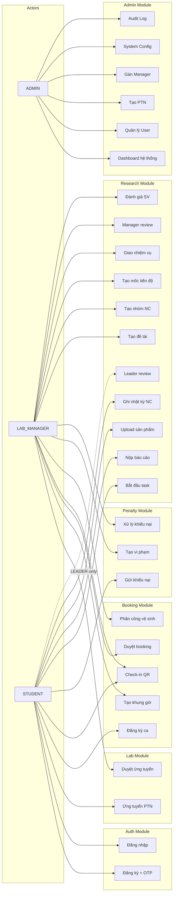

# Danh sách Use Case — Dự án Lab Portal

> **Phạm vi:** Chương 3 báo cáo môn Dự án Công nghệ
> **Nguồn:** Trích xuất trực tiếp từ source code (controller, service, entity)

---

## Phần 1: Bảng tổng hợp Use Case theo Role

### 1.1. Use Case — ADMIN

| Mã | Tên Use Case | Mô tả ngắn |
|----|-------------|-------------|
| UC-01 | Xem dashboard hệ thống | Thống kê tổng user, PTN, booking |
| UC-02 | Quản lý tài khoản người dùng | Danh sách user, ban/unban, đổi role |
| UC-03 | Tạo PTN mới | Nhập thông tin PTN, trạng thái AVAILABLE |
| UC-04 | Gán Manager cho PTN | Liên kết LAB_MANAGER với PTN |
| UC-05 | Quản lý cấu hình hệ thống | Key-value config, audit trail |
| UC-06 | Xem nhật ký kiểm toán | Tra cứu audit log |

### 1.2. Use Case — LAB_MANAGER

| Mã | Tên Use Case | Mô tả ngắn |
|----|-------------|-------------|
| UC-07 | Duyệt hồ sơ ứng tuyển | APPROVED → tạo Membership / REJECTED |
| UC-08 | Tạo khung giờ sử dụng | Ngày, giờ, sức chứa |
| UC-09 | Duyệt đăng ký ca sử dụng | APPROVED / REJECTED |
| UC-10 | Xác nhận check-in (quét QR) | Quét QR token → CHECKED_IN |
| UC-11 | Phân công vệ sinh | Chọn SV, tạo cleaning task |
| UC-12 | Tạo vi phạm | Loại, điểm, lý do |
| UC-13 | Xử lý khiếu nại | RESOLVED / REJECTED |
| UC-14 | Tạo đề tài nghiên cứu | Tên, mô tả, trạng thái |
| UC-15 | Tạo nhóm nghiên cứu | Thêm SV, chỉ định Leader |
| UC-16 | Tạo mốc tiến độ | Deadline, gán nhóm |
| UC-17 | Giao nhiệm vụ | Gán cho SV, deadline |
| UC-18 | Manager duyệt báo cáo (cấp 2) | APPROVED / MANAGER_REJECTED |
| UC-19 | Đánh giá sinh viên | 5 tiêu chí + nhận xét |

### 1.3. Use Case — STUDENT (MEMBER)

| Mã | Tên Use Case | Mô tả ngắn |
|----|-------------|-------------|
| UC-20 | Đăng ký và xác thực email | 3 bước: email → OTP → thông tin |
| UC-21 | Đăng nhập | JWT access + refresh token |
| UC-22 | Ứng tuyển vào PTN | Upload CV, nộp đơn |
| UC-23 | Đăng ký ca sử dụng | Booking slot, waitlist nếu đầy |
| UC-24 | Check-in bằng QR | Tạo QR → Manager quét |
| UC-25 | Gửi khiếu nại | Khiếu nại vi phạm |
| UC-26 | Bắt đầu nhiệm vụ | TODO → DOING |
| UC-27 | Nộp báo cáo tiến độ | Upload file + nội dung, version auto |
| UC-28 | Cập nhật/nộp lại báo cáo | Sửa hoặc nộp version mới |
| UC-29 | Upload sản phẩm NC | File + link, chọn loại |
| UC-30 | Ghi nhật ký nghiên cứu | workDate, duration, content |

### 1.4. Use Case — STUDENT (LEADER)

| Mã | Tên Use Case | Mô tả ngắn |
|----|-------------|-------------|
| — | Kế thừa toàn bộ UC-20 → UC-30 | Mọi quyền của MEMBER |
| UC-31 | Leader review báo cáo (cấp 1) | ACCEPT / NEEDS_REVISION / REJECT |

---

## Phần 2: Đặc tả Use Case Chi tiết

---

### UC-20: Đăng ký và Xác thực Email

| Thuộc tính | Nội dung |
|------------|----------|
| **Tên** | Đăng ký tài khoản với xác thực email |
| **Mã** | UC-20 |
| **Tác nhân** | Khách (chưa có tài khoản) |
| **Mục tiêu** | Tạo tài khoản STUDENT thông qua xác thực email OTP 3 bước |
| **Tiền điều kiện** | Email chưa đăng ký trong hệ thống |

**Luồng chính:**
1. Người dùng truy cập trang Đăng ký.
2. Người dùng nhập địa chỉ email.
3. Hệ thống kiểm tra email chưa tồn tại → tạo mã OTP 6 ký tự → mã hóa BCrypt → lưu Redis (có TTL) → gửi email qua SMTP.
4. Người dùng nhận email, nhập mã OTP.
5. Hệ thống so sánh hash OTP → khớp → cấp **temporary token** → lưu Redis.
6. Người dùng điền thông tin: username, password, họ tên, số điện thoại + kèm temp token.
7. Hệ thống xác minh temp token → tạo tài khoản (password BCrypt, role STUDENT) → trả JWT.

**Luồng thay thế:**
- 3a. Email đã tồn tại → thông báo lỗi "Email đã được sử dụng".
- 5a. OTP sai → thông báo lỗi "Mã xác thực không đúng".
- 5b. OTP hết hạn (TTL Redis) → thông báo "Mã đã hết hạn, vui lòng gửi lại".
- 7a. Temp token không hợp lệ hoặc hết hạn → yêu cầu bắt đầu lại từ bước 2.
- 7b. Username đã tồn tại → thông báo lỗi.

**Hậu điều kiện:** Tài khoản STUDENT được tạo trong bảng `users`, liên kết role STUDENT qua `user_roles`. Người dùng có thể đăng nhập.

---

### UC-21: Đăng nhập

| Thuộc tính | Nội dung |
|------------|----------|
| **Tên** | Đăng nhập hệ thống |
| **Mã** | UC-21 |
| **Tác nhân** | Tất cả (ADMIN, LAB_MANAGER, STUDENT) |
| **Mục tiêu** | Xác thực người dùng, cấp JWT để truy cập hệ thống |
| **Tiền điều kiện** | Có tài khoản hợp lệ, chưa bị khóa (banned) |

**Luồng chính:**
1. Người dùng truy cập trang Đăng nhập.
2. Người dùng nhập email hoặc username + mật khẩu.
3. Hệ thống xác thực qua `DaoAuthenticationProvider` (so sánh BCrypt).
4. Xác thực thành công → `JwtService` tạo access token (24h) + refresh token (7 ngày).
5. Frontend lưu token vào `localStorage`.
6. Hệ thống chuyển hướng đến trang chủ tương ứng role (Admin Portal / Manager Portal / User Portal).

**Luồng thay thế:**
- 3a. Sai mật khẩu → thông báo "Thông tin đăng nhập không chính xác".
- 3b. Tài khoản bị khóa (banned) → thông báo "Tài khoản đã bị khóa".
- 3c. Tài khoản không tồn tại → thông báo lỗi chung (không tiết lộ tài khoản có tồn tại).

**Hậu điều kiện:** Người dùng được xác thực, mọi request tiếp theo gắn `Authorization: Bearer {token}`.

---

### UC-22: Ứng tuyển vào PTN

| Thuộc tính | Nội dung |
|------------|----------|
| **Tên** | Nộp đơn ứng tuyển phòng thí nghiệm |
| **Mã** | UC-22 |
| **Tác nhân** | STUDENT |
| **Mục tiêu** | Gửi đơn ứng tuyển vào PTN mong muốn |
| **Tiền điều kiện** | Đã đăng nhập. PTN ở trạng thái AVAILABLE. Chưa có đơn PENDING hoặc APPROVED cho PTN này. |

**Luồng chính:**
1. Sinh viên xem danh sách PTN đang hoạt động.
2. Sinh viên chọn PTN muốn ứng tuyển.
3. Sinh viên upload file CV (hoặc nhập URL CV).
4. Hệ thống kiểm tra không có đơn trùng → tạo Application (status: PENDING) → lưu file CV.
5. Hiển thị thông báo "Đơn ứng tuyển đã được gửi, chờ duyệt".

**Luồng thay thế:**
- 4a. Đã có đơn PENDING cho PTN này → `DuplicateApplicationException` → "Bạn đã có đơn đang chờ duyệt".
- 4b. Đã có đơn APPROVED → "Bạn đã là thành viên PTN này".
- 4c. Đơn cũ bị REJECTED → cho phép nộp đơn mới (V26 migration).

**Hậu điều kiện:** Application record được tạo, LAB_MANAGER có thể xem và xử lý.

---

### UC-07: Duyệt hồ sơ Ứng tuyển

| Thuộc tính | Nội dung |
|------------|----------|
| **Tên** | Duyệt hồ sơ ứng tuyển PTN |
| **Mã** | UC-07 |
| **Tác nhân** | LAB_MANAGER |
| **Mục tiêu** | Xem xét và xử lý đơn ứng tuyển của sinh viên |
| **Tiền điều kiện** | Đã đăng nhập. Được gán quản lý PTN. Đơn ở trạng thái PENDING. |

**Luồng chính:**
1. Manager xem danh sách đơn ứng tuyển PTN mình quản lý (phân trang, sắp xếp).
2. Manager chọn đơn cần xử lý → xem chi tiết: thông tin SV, CV file/URL.
3. Manager đưa ra quyết định:
   - **Duyệt (APPROVED):** Hệ thống tạo Membership (user_id, lab_id, active=true) → SV trở thành thành viên.
   - **Từ chối (REJECTED):** Ghi review_note lý do từ chối.
4. Trạng thái đơn được cập nhật.

**Luồng thay thế:**
- 2a. Đơn đã được xử lý (không còn PENDING) → `ApplicationAlreadyReviewedException`.
- 3a. Manager cố duyệt đơn PTN khác → hệ thống từ chối (kiểm tra quyền sở hữu).

**Hậu điều kiện:** Đơn chuyển APPROVED hoặc REJECTED. Nếu APPROVED → Membership active được tạo.

---

### UC-08: Tạo khung giờ Sử dụng

| Thuộc tính | Nội dung |
|------------|----------|
| **Tên** | Tạo khung giờ sử dụng PTN |
| **Mã** | UC-08 |
| **Tác nhân** | LAB_MANAGER |
| **Mục tiêu** | Tạo khung thời gian cho sinh viên đăng ký sử dụng PTN |
| **Tiền điều kiện** | Đã đăng nhập. Được gán quản lý PTN. PTN ở trạng thái AVAILABLE. |

**Luồng chính:**
1. Manager chọn mục Quản lý khung giờ.
2. Manager nhập thông tin: ngày, giờ bắt đầu, giờ kết thúc, sức chứa (capacity).
3. Hệ thống tạo TimeSlot (status: AVAILABLE).
4. Khung giờ hiển thị trong danh sách, SV có thể đăng ký.

**Luồng thay thế:**
- 2a. Giờ bắt đầu > giờ kết thúc → `InvalidDateRangeException`.
- 2b. Ngày trong quá khứ → từ chối.

**Hậu điều kiện:** TimeSlot được tạo, SV có thể đăng ký (booking).

---

### UC-23: Đăng ký ca Sử dụng

| Thuộc tính | Nội dung |
|------------|----------|
| **Tên** | Đăng ký sử dụng phòng thí nghiệm |
| **Mã** | UC-23 |
| **Tác nhân** | STUDENT (có membership active) |
| **Mục tiêu** | Đăng ký sử dụng PTN trong một khung giờ cụ thể |
| **Tiền điều kiện** | Đã đăng nhập. Có membership active trong PTN. Slot ở trạng thái AVAILABLE. |

**Luồng chính:**
1. Sinh viên xem danh sách khung giờ PTN mình thuộc về.
2. Sinh viên chọn khung giờ phù hợp.
3. Hệ thống kiểm tra capacity → còn chỗ → tạo Booking (status: PENDING_APPROVAL).
4. Hiển thị "Đăng ký thành công, chờ duyệt".

**Luồng thay thế:**
- 3a. Đã đăng ký slot này rồi → `DuplicateBookingException` → "Bạn đã đăng ký ca này".
- 3b. Slot đầy (capacity = 0) → hệ thống tạo WaitlistEntity (position auto-increment, **pessimistic locking** đảm bảo thứ tự khi đồng thời) → "Bạn đã được thêm vào hàng đợi, vị trí #X".
- 3c. Slot bị hủy hoặc đã hoàn thành → từ chối đăng ký.

**Hậu điều kiện:** Booking PENDING_APPROVAL hoặc Waitlist entry được tạo.

---

### UC-09: Duyệt đăng ký ca Sử dụng

| Thuộc tính | Nội dung |
|------------|----------|
| **Tên** | Duyệt đăng ký sử dụng PTN |
| **Mã** | UC-09 |
| **Tác nhân** | LAB_MANAGER |
| **Mục tiêu** | Xem xét và phê duyệt đăng ký sử dụng PTN của sinh viên |
| **Tiền điều kiện** | Đã đăng nhập. Booking ở trạng thái PENDING_APPROVAL. |

**Luồng chính:**
1. Manager xem danh sách booking theo slot.
2. Manager chọn booking → xem thông tin SV.
3. Manager quyết định:
   - **Duyệt (APPROVED):** SV được xác nhận quyền sử dụng.
   - **Từ chối (REJECTED):** SV có thể đăng ký slot khác.

**Luồng thay thế:**
- 3a. Booking không thuộc PTN mình → từ chối.

**Hậu điều kiện:** Booking chuyển APPROVED hoặc REJECTED.

---

### UC-24: Check-in bằng QR Code

| Thuộc tính | Nội dung |
|------------|----------|
| **Tên** | Xác nhận có mặt bằng QR code |
| **Mã** | UC-24 |
| **Tác nhân** | STUDENT (tạo QR) + LAB_MANAGER (quét QR) |
| **Mục tiêu** | Xác nhận sinh viên có mặt tại PTN trong ca sử dụng |
| **Tiền điều kiện** | Booking ở trạng thái APPROVED. Đang trong khoảng thời gian khung giờ. |

**Luồng chính:**
1. Sinh viên mở ứng dụng, chọn booking đã được duyệt.
2. Sinh viên nhấn "Tạo mã QR" → hệ thống tạo QR token (short-lived).
3. Sinh viên đưa màn hình QR cho Manager.
4. Manager dùng chức năng "Xác nhận check-in" → nhập/quét token.
5. Hệ thống xác minh: đúng SV, đúng slot, trong thời gian hợp lệ → cập nhật booking CHECKED_IN, ghi `checked_in_at`.

**Luồng thay thế:**
- 2a. Booking chưa được duyệt → không cho tạo QR.
- 5a. QR token hết hạn → "Mã đã hết hạn, vui lòng tạo lại".
- 5b. Check-in ngoài thời gian cho phép → `InvalidCheckinTimeException`.
- 5c. Token không hợp lệ → "Mã không hợp lệ".

**Hậu điều kiện:** Booking → CHECKED_IN, thời điểm check-in được ghi nhận.

---

### UC-11: Phân công Vệ sinh

| Thuộc tính | Nội dung |
|------------|----------|
| **Tên** | Phân công vệ sinh phòng thí nghiệm |
| **Mã** | UC-11 |
| **Tác nhân** | LAB_MANAGER |
| **Mục tiêu** | Phân công sinh viên vệ sinh PTN sau ca sử dụng |
| **Tiền điều kiện** | Slot đã kết thúc hoặc đang diễn ra. Có SV đã check-in. |

**Luồng chính:**
1. Manager chọn slot cần phân công vệ sinh.
2. Hệ thống hiển thị danh sách SV đủ điều kiện (đã check-in trong slot đó).
3. Manager chọn một hoặc nhiều SV.
4. Hệ thống tạo CleaningTask (status: PENDING) cho mỗi SV được chọn.

**Luồng thay thế:**
- 2a. Không có SV nào check-in → danh sách trống, không thể phân công.

**Hậu điều kiện:** CleaningTask PENDING được tạo, SV xem trong "Nhiệm vụ vệ sinh của tôi". SV có thể xác nhận hoàn thành (→ COMPLETED) hoặc Manager hủy (→ CANCELLED).

---

### UC-12: Tạo Vi phạm

| Thuộc tính | Nội dung |
|------------|----------|
| **Tên** | Ghi nhận vi phạm sinh viên |
| **Mã** | UC-12 |
| **Tác nhân** | LAB_MANAGER |
| **Mục tiêu** | Ghi nhận hành vi vi phạm quy định sử dụng PTN |
| **Tiền điều kiện** | Đã đăng nhập. SV là thành viên PTN mình quản lý. |

**Luồng chính:**
1. Manager chọn chức năng Ghi nhận vi phạm.
2. Manager chọn sinh viên vi phạm.
3. Manager chọn khung giờ liên quan.
4. Manager chọn loại vi phạm: NO_SHOW / LATE_CHECKIN / EQUIPMENT_DAMAGE / NOISE / OTHER.
5. Manager nhập điểm phạt (point) và lý do chi tiết.
6. Hệ thống tạo Penalty (status: ACTIVE).

**Luồng thay thế:**
- *(Không có luồng thay thế đặc biệt)*

**Hậu điều kiện:** Penalty ACTIVE được tạo, SV có thể xem trong lịch sử vi phạm và gửi khiếu nại.

---

### UC-25: Gửi Khiếu nại

| Thuộc tính | Nội dung |
|------------|----------|
| **Tên** | Gửi khiếu nại về vi phạm |
| **Mã** | UC-25 |
| **Tác nhân** | STUDENT |
| **Mục tiêu** | Phản đối một vi phạm mà SV cho rằng không chính xác |
| **Tiền điều kiện** | Đã đăng nhập. Có vi phạm (Penalty) liên quan. |

**Luồng chính:**
1. Sinh viên xem lịch sử vi phạm của mình.
2. Sinh viên chọn vi phạm muốn khiếu nại.
3. Sinh viên nhập nội dung khiếu nại (mô tả lý do).
4. Hệ thống tạo Complaint (status: PENDING, liên kết penalty_id).

**Luồng thay thế:**
- *(Không có luồng thay thế đặc biệt)*

**Hậu điều kiện:** Complaint PENDING được tạo, Manager xem trong danh sách khiếu nại PTN → xử lý (RESOLVED/REJECTED).

---

### UC-14: Tạo Đề tài Nghiên cứu

| Thuộc tính | Nội dung |
|------------|----------|
| **Tên** | Tạo đề tài nghiên cứu khoa học |
| **Mã** | UC-14 |
| **Tác nhân** | LAB_MANAGER |
| **Mục tiêu** | Tạo đề tài NC mới cho PTN phục vụ hoạt động NCKH sinh viên |
| **Tiền điều kiện** | Đã đăng nhập. Được gán quản lý PTN. |

**Luồng chính:**
1. Manager chọn mục Quản lý đề tài.
2. Manager nhập: tên đề tài, mô tả chi tiết, yêu cầu, tài liệu tham khảo.
3. Hệ thống tạo ResearchTopic (status: RECRUITING, gắn lab_id).

**Luồng thay thế:**
- *(Không có luồng thay thế đặc biệt)*

**Hậu điều kiện:** Đề tài RECRUITING được tạo, Manager có thể tạo nhóm NC gắn với đề tài này. Trạng thái có thể chuyển: RECRUITING → ACTIVE → CLOSED.

---

### UC-15: Tạo Nhóm Nghiên cứu

| Thuộc tính | Nội dung |
|------------|----------|
| **Tên** | Tạo nhóm nghiên cứu và thêm thành viên |
| **Mã** | UC-15 |
| **Tác nhân** | LAB_MANAGER |
| **Mục tiêu** | Tổ chức sinh viên thành nhóm NC, chỉ định trưởng nhóm |
| **Tiền điều kiện** | Đã đăng nhập. PTN có thành viên. Có đề tài hoặc dự án để gắn. |

**Luồng chính:**
1. Manager chọn mục Quản lý nhóm NC.
2. Manager nhập tên nhóm, chọn đề tài/dự án liên quan.
3. Manager xem danh sách SV đủ điều kiện (thành viên PTN active).
4. Manager chọn SV, chỉ định 1 người làm **LEADER**, còn lại là **MEMBER**.
5. Hệ thống tạo ResearchGroup + GroupMember records.

**Luồng thay thế:**
- 4a. Thêm SV đã có trong nhóm → `DuplicateMemberException`.
- 4b. Không chỉ định Leader → hệ thống cảnh báo.

**Hậu điều kiện:** ResearchGroup ACTIVE được tạo. GroupMember records lưu userId + GroupRole (LEADER/MEMBER). SV có thể xem nhóm mình thuộc về.

---

### UC-16: Tạo Mốc Tiến độ

| Thuộc tính | Nội dung |
|------------|----------|
| **Tên** | Tạo mốc tiến độ cho dự án nghiên cứu |
| **Mã** | UC-16 |
| **Tác nhân** | LAB_MANAGER |
| **Mục tiêu** | Chia dự án thành các giai đoạn có deadline rõ ràng |
| **Tiền điều kiện** | Đã có dự án NC và nhóm NC. |

**Luồng chính:**
1. Manager mở dự án NC, chọn mục Mốc tiến độ.
2. Manager nhập: tiêu đề, mô tả, ngày bắt đầu, deadline.
3. Manager gán milestone cho nhóm NC cụ thể.
4. Hệ thống tạo Milestone (status: NOT_STARTED, progress: 0%).

**Luồng thay thế:**
- 2a. Ngày bắt đầu > deadline → `InvalidDateRangeException`.

**Hậu điều kiện:** Milestone NOT_STARTED được tạo, Manager có thể tạo task bên trong. Trạng thái: NOT_STARTED → IN_PROGRESS → WAITING_REVIEW → COMPLETED / OVERDUE.

---

### UC-17: Giao Nhiệm vụ

| Thuộc tính | Nội dung |
|------------|----------|
| **Tên** | Tạo và giao nhiệm vụ cho sinh viên |
| **Mã** | UC-17 |
| **Tác nhân** | LAB_MANAGER |
| **Mục tiêu** | Phân công công việc cụ thể cho từng SV trong nhóm |
| **Tiền điều kiện** | Đã có milestone. Nhóm có thành viên. |

**Luồng chính:**
1. Manager mở milestone, chọn "Tạo nhiệm vụ".
2. Manager nhập: tiêu đề, mô tả, deadline.
3. Manager chọn người thực hiện (assignee) từ danh sách thành viên nhóm.
4. Hệ thống tạo Task (status: TODO, gán milestone_id + group_id + assignee_id).

**Luồng thay thế:**
- 3a. Người được chọn không thuộc nhóm → `InvalidAssigneeException`.

**Hậu điều kiện:** Task TODO được tạo, hiển thị trên task board (cột "Cần làm"). SV được gán xem trong "Nhiệm vụ của tôi".

---

### UC-26: Bắt đầu Nhiệm vụ

| Thuộc tính | Nội dung |
|------------|----------|
| **Tên** | Bắt đầu thực hiện nhiệm vụ |
| **Mã** | UC-26 |
| **Tác nhân** | STUDENT (MEMBER / LEADER) |
| **Mục tiêu** | Đánh dấu bắt đầu thực hiện một nhiệm vụ được giao |
| **Tiền điều kiện** | Task ở trạng thái TODO. SV là assignee của task. |

**Luồng chính:**
1. Sinh viên mở task board, xem nhiệm vụ ở cột "Cần làm".
2. Sinh viên chọn task, nhấn "Bắt đầu" (hoặc kéo thả sang cột "Đang làm").
3. Hệ thống cập nhật task status: TODO → DOING.

**Luồng thay thế:**
- 1a. Task không phải của SV hiện tại → không cho cập nhật (Member chỉ thấy task mình).

**Hậu điều kiện:** Task chuyển sang DOING, hiển thị ở cột "Đang làm" trên task board.

---

### UC-27: Nộp Báo cáo Tiến độ

| Thuộc tính | Nội dung |
|------------|----------|
| **Tên** | Nộp báo cáo tiến độ cho nhiệm vụ |
| **Mã** | UC-27 |
| **Tác nhân** | STUDENT (MEMBER / LEADER) |
| **Mục tiêu** | Ghi nhận kết quả công việc, nộp lên để review |
| **Tiền điều kiện** | Task ở trạng thái DOING hoặc NEEDS_REVISION. SV thuộc nhóm NC. |

**Luồng chính:**
1. Sinh viên chọn task, nhấn "Nộp báo cáo".
2. Sinh viên điền 5 nội dung:
   - Nội dung đã thực hiện (`contentDone`)
   - Kết quả đạt được (`result`)
   - Khó khăn gặp phải (`difficulty`)
   - Kế hoạch tiếp theo (`nextPlan`)
   - Tự đánh giá (`selfAssessment`)
3. Sinh viên upload file đính kèm (**bắt buộc**).
4. Sinh viên có thể thêm evidence link (tùy chọn).
5. Hệ thống gán version tự động (v1 cho lần đầu) → tạo Report (status: SUBMITTED).

**Luồng thay thế:**
- 3a. Không upload file → hệ thống từ chối.
- 5a. Trùng version (task_id + submitted_by_id + version) → `ReportVersionConflictException`.

**Hậu điều kiện:** Report SUBMITTED được tạo (version = N). Leader nhìn thấy trong danh sách báo cáo nhóm → chờ review cấp 1.

> **Lưu ý:** Nếu người nộp là **Leader** → báo cáo bỏ qua bước Leader review, chuyển thẳng sang chờ Manager duyệt.

---

### UC-28: Cập nhật / Nộp lại Báo cáo

| Thuộc tính | Nội dung |
|------------|----------|
| **Tên** | Cập nhật hoặc nộp lại báo cáo |
| **Mã** | UC-28 |
| **Tác nhân** | STUDENT (MEMBER / LEADER) |
| **Mục tiêu** | Chỉnh sửa báo cáo bị yêu cầu sửa hoặc bị từ chối |
| **Tiền điều kiện** | Báo cáo ở trạng thái NEEDS_REVISION hoặc LEADER_REJECTED hoặc MANAGER_REJECTED. |

**Luồng chính — Trường hợp 1: Thay thế nội dung (PATCH replace):**
1. SV chọn báo cáo bị yêu cầu sửa.
2. SV cập nhật nội dung và/hoặc file đính kèm.
3. Hệ thống cập nhật báo cáo hiện tại → status reset về SUBMITTED.

**Luồng chính — Trường hợp 2: Nộp phiên bản mới (POST):**
1. SV chọn task → nộp báo cáo mới.
2. Hệ thống gán version = version cũ + 1 → tạo Report mới (SUBMITTED).
3. Phiên bản cũ được giữ lại làm lịch sử (không xóa).

**Luồng thay thế:**
- *(Tương tự UC-27)*

**Hậu điều kiện:** Báo cáo mới/cập nhật ở trạng thái SUBMITTED, quay lại quy trình review.

---

### UC-31: Leader Review Báo cáo (Cấp 1)

| Thuộc tính | Nội dung |
|------------|----------|
| **Tên** | Duyệt báo cáo cấp nhóm (Leader review) |
| **Mã** | UC-31 |
| **Tác nhân** | STUDENT (LEADER) |
| **Mục tiêu** | Xem xét và duyệt báo cáo của thành viên nhóm trước khi chuyển lên Manager |
| **Tiền điều kiện** | SV có GroupRole = LEADER trong nhóm. Báo cáo ở trạng thái SUBMITTED. Báo cáo **không phải** do Leader tự nộp. |

**Luồng chính:**
1. Leader xem danh sách báo cáo nhóm (GET /groups/{id}/reports).
2. Leader chọn báo cáo SUBMITTED của thành viên.
3. Leader xem nội dung 5 mục + download file đính kèm.
4. Leader đưa ra quyết định:
   - **Chấp nhận (ACCEPT):** Báo cáo → LEADER_REVIEWED → chuyển lên Manager.
   - **Yêu cầu sửa (NEEDS_REVISION):** Báo cáo → NEEDS_REVISION → Member sửa lại.
   - **Từ chối (REJECT):** Báo cáo → LEADER_REJECTED → Member nộp version mới.
5. Leader ghi nhận xét (`leaderComment`).
6. Hệ thống ghi nhận leader_reviewer_id và thời điểm review.

**Luồng thay thế:**
- 3a. Báo cáo do chính Leader nộp → **bước này bị bỏ qua hoàn toàn**, báo cáo chuyển thẳng lên Manager review (UC-18).

**Hậu điều kiện:** Báo cáo chuyển sang LEADER_REVIEWED (chờ Manager) hoặc NEEDS_REVISION / LEADER_REJECTED (trả về Member).

---

### UC-18: Manager Duyệt Báo cáo (Cấp 2)

| Thuộc tính | Nội dung |
|------------|----------|
| **Tên** | Duyệt báo cáo cấp Manager (cấp cuối) |
| **Mã** | UC-18 |
| **Tác nhân** | LAB_MANAGER |
| **Mục tiêu** | Xem xét và đưa ra quyết định cuối cùng cho báo cáo |
| **Tiền điều kiện** | Báo cáo ở trạng thái LEADER_REVIEWED. Báo cáo thuộc PTN mình quản lý. |

**Luồng chính:**
1. Manager xem danh sách báo cáo chờ duyệt trong PTN (GET /labs/{id}/reports/pending-review).
2. Manager chọn báo cáo → xem nội dung + file + nhận xét Leader.
3. Manager quyết định:
   - **Duyệt (APPROVE):** Báo cáo → APPROVED.
   - **Từ chối (REJECT):** Báo cáo → MANAGER_REJECTED → Member nộp version mới.
4. Manager ghi nhận xét (`managerComment`).
5. Hệ thống ghi nhận manager_reviewer_id và thời điểm.

**Luồng thay thế:**
- *(Không có luồng thay thế đặc biệt)*

**Hậu điều kiện:** Báo cáo APPROVED (chính thức được chấp nhận, task có thể chuyển DONE) hoặc MANAGER_REJECTED (Member nộp lại).

---

### UC-29: Upload Sản phẩm Nghiên cứu

| Thuộc tính | Nội dung |
|------------|----------|
| **Tên** | Nộp sản phẩm nghiên cứu |
| **Mã** | UC-29 |
| **Tác nhân** | STUDENT (MEMBER / LEADER) |
| **Mục tiêu** | Nộp sản phẩm đầu ra của quá trình nghiên cứu |
| **Tiền điều kiện** | SV thuộc nhóm NC. Có dự án NC đang hoạt động. |

**Luồng chính:**
1. Sinh viên chọn dự án/nhóm NC → mục "Sản phẩm".
2. Sinh viên chọn loại sản phẩm: FINAL_REPORT / SLIDE / SOURCE_CODE / DATASET / DEMO_VIDEO / PAPER / SOFTWARE_DEMO / OTHER.
3. Sinh viên nhập tiêu đề.
4. Sinh viên upload file và/hoặc nhập external link (URL).
5. Hệ thống tạo Product (status: SUBMITTED, version tự tăng).

**Luồng thay thế:**
- 4a. Không có file lẫn link → từ chối.

**Hậu điều kiện:** Product SUBMITTED được tạo, Manager + Leader có thể xem. Trạng thái có thể chuyển: SUBMITTED → APPROVED / REJECTED.

---

### UC-19: Đánh giá Sinh viên

| Thuộc tính | Nội dung |
|------------|----------|
| **Tên** | Đánh giá sinh viên trong dự án nghiên cứu |
| **Mã** | UC-19 |
| **Tác nhân** | LAB_MANAGER |
| **Mục tiêu** | Đánh giá kết quả tham gia NCKH của từng sinh viên theo nhiều tiêu chí |
| **Tiền điều kiện** | Dự án thuộc PTN mình quản lý. SV là thành viên nhóm trong dự án. |

**Luồng chính:**
1. Manager mở dự án NC → chọn "Đánh giá sinh viên".
2. Manager chọn sinh viên cần đánh giá.
3. Manager nhập điểm cho 5 tiêu chí:

| Tiêu chí | Ý nghĩa |
|----------|---------|
| `contributionScore` | Mức đóng góp tổng thể |
| `taskScore` | Hoàn thành nhiệm vụ |
| `reportScore` | Chất lượng báo cáo |
| `productScore` | Sản phẩm đầu ra |
| `attitudeScore` | Thái độ, kỷ luật |

4. Manager nhập nhận xét tổng hợp (`lecturerComment`).
5. Hệ thống tính tổng điểm (`totalScore`) → lưu Evaluation.

**Luồng thay thế:**
- 3a. Điểm ngoài thang cho phép → `InvalidEvaluationScoreException`.

**Hậu điều kiện:** Evaluation được tạo, SV có thể xem kết quả đánh giá cá nhân.

---

### UC-30: Ghi Nhật ký Nghiên cứu

| Thuộc tính | Nội dung |
|------------|----------|
| **Tên** | Ghi nhật ký nghiên cứu hàng ngày |
| **Mã** | UC-30 |
| **Tác nhân** | STUDENT (MEMBER / LEADER) hoặc LAB_MANAGER |
| **Mục tiêu** | Ghi nhận hoạt động nghiên cứu hàng ngày phục vụ theo dõi và đánh giá |
| **Tiền điều kiện** | Thuộc nhóm NC hoặc là Manager quản lý PTN có dự án. |

**Luồng chính:**
1. Người dùng chọn dự án/nhóm → mục "Nhật ký nghiên cứu".
2. Người dùng nhập:
   - Ngày làm việc (`workDate`)
   - Thời lượng (`durationMinutes`)
   - Nội dung đã thực hiện (`content`)
   - Kết quả (`result`)
   - Vấn đề gặp phải (`problem`)
   - Kế hoạch tiếp (`nextPlan`)
3. Chọn phạm vi hiển thị (visibility): GROUP / PROJECT / PRIVATE.
4. Hệ thống tạo ResearchLog (logType: MANUAL).

**Luồng thay thế:**
- *(Không có luồng thay thế đặc biệt)*

**Hậu điều kiện:** ResearchLog được tạo, hiển thị trong danh sách nhật ký (có filter: nhóm, milestone, task, tác giả, loại). Leader xem được nhật ký toàn nhóm, Member chỉ xem nhật ký của mình.

---

## Phần 3: Sơ đồ Use Case (Gợi ý vẽ)

### 3.1. Use Case tổng quát

### 3.2. Quy ước khi vẽ biểu đồ Use Case (UML)

Khi chuyển sang biểu đồ Use Case UML chính thức cho báo cáo:

| Quan hệ | Ký hiệu | Ví dụ |
|---------|---------|-------|
| **Actor → Use Case** | Đường liền | STUDENT → Đăng ký ca |
| **Include** | `<<include>>` | Đăng ký ca `<<include>>` Kiểm tra Membership |
| **Extend** | `<<extend>>` | Leader review `<<extend>>` Nộp báo cáo |
| **Generalization** | Mũi tên tam giác | LEADER ◁── STUDENT (kế thừa) |

Gợi ý chia thành **4 biểu đồ riêng** cho dễ đọc:
1. Use Case ADMIN (6 UC)
2. Use Case LAB_MANAGER — Vận hành PTN (7 UC)
3. Use Case LAB_MANAGER — NCKH (6 UC)
4. Use Case STUDENT — MEMBER + LEADER (12 UC)
